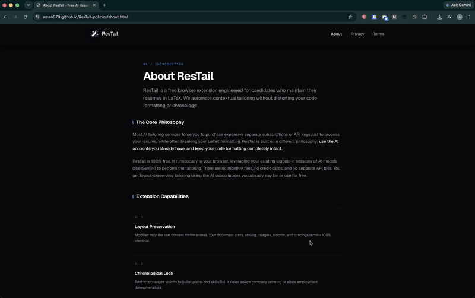

# ResTail

[](#)

Tailor your resume for specific job descriptions using AI directly in your browser. ResTail is an open-source Chrome Extension that automates the process of rewriting your LaTeX resume against job postings using popular AI models.



## Why It's Free

- **No API Keys Required:** ResTail connects directly to your active browser sessions (Gemini, ChatGPT, Claude) to format and tailor your resume.
- **Zero Server Costs:** All orchestration happens locally in your browser. No middleman servers, no rate limits, and no subscription fees.
- **Privacy First:** Your resume and job descriptions stay in your browser and are sent only to the AI provider you choose. We never collect, store, or sell your data.

## Features

- **Seamless AI Integration:** Works directly with Gemini, ChatGPT (experimental), and Claude (experimental).
- **LaTeX Support:** Upload your `.tex` resume or paste raw LaTeX code.
- **Privacy-First Workflow:** Uses your own active sessions for AI providers—no API keys required.
- **Inline PDF Previewer:** Renders the AI-tailored LaTeX back into a PDF preview in your browser instantly.

## Local Development Setup

To run this extension locally for development or testing:

1. **Clone the repository:**
   ```bash
   git clone https://github.com/aman879/ResTrail.git
   cd ResTrail
   ```

2. **Install dependencies:**
   *(Note: This project uses `pnpm`. Do not use `npm` or `yarn`.)*
   ```bash
   pnpm install
   ```

3. **Build the extension:**
   ```bash
   pnpm build
   ```
   *This will compile the TypeScript and React code into a `dist/` folder.*

4. **Load into Chrome:**
   - Open Chrome and navigate to `chrome://extensions/`
   - Enable **Developer mode** in the top right corner.
   - Click **Load unpacked** in the top left.
   - Select the newly generated `dist/` folder from the `ResTrail` directory.

## Contributing

We welcome contributions! Please follow these steps to contribute:

1. Fork the repository.
2. Create a new branch for your feature or bug fix (`git checkout -b feature/amazing-feature`).
3. Make your changes.
4. Run `pnpm lint` and `pnpm build` to ensure everything is compiling correctly.
5. Commit your changes (`git commit -m 'feat: added amazing feature'`).
6. Push to your branch (`git push origin feature/amazing-feature`).
7. Open a Pull Request!

## License

This project is licensed under the MIT License - see the [LICENSE](LICENSE) file for details.
